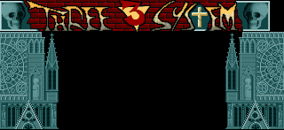
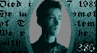
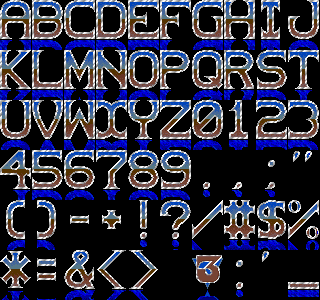

# ThreeSystem-Horror-89


## Music
- Item	Value
- Base address	$14D74
- Format	Soundtracker / NoiseTracker, 15 samples (no "M.K." signature)
- Title	goomy
- Song length	29 positions, restart 120, 18 patterns
- Sample headers	$14D88 – $14FCA (15 × 30 bytes)
- Pattern data	$14FCC – $197CC (18 × 1024)
- Sample data	$197CC – $442C6 (174,842 bytes)
- End / total size	$442C6 — 193,874 bytes ($2F552)
- ### Music [▶️ Play goomy.mod](https://www.stef.be/bassoontracker/?file=https%3A%2F%2Fraw.githubusercontent.com%2FOzzyboshi%2FThreeSystem-Horror-89%2Fmain%2Fwork%2Fassets%2Fgoomy.mod)

## Graphics — all raw planar, 5 bitplanes, lores

| Address | Size (px) | Size (bytes | Description | Img |
| --- | --- | --- | --- | -- |
| $4590C | 320 × 147 | 29400 | Logo + cathedral (top panel) | 
| $4CBE4 | 192 × 64 | 7680 | sheet of 32×32 icons | 
| $4E9E4 | 160 × 88 | 8800 | Portrait A | 
| $50C44 | 160 × 88 | 8800 | Portrait B (1989 obituary) | 
| $52EA4 | 320 × 49 | 9800 | Bottom panel, 8 gothic windows | 
| $554EC | 320 × 300 | 60000 | Font sheet, 10×6 grid of 32×50 glyphs | 


## Text
```
first all: forgive my ital-english...
and now welcome to the horror demo made by @ three system...
who write this text is me (naturally) and me is called > cold < ,yes,cold of @ (three system).
   and now you wonder that the number of members of @ is  2;
but many other friends giving us moral support!
the name of the second member of @ is > 386 < yea!
three system is ** cold & 386 ** you can see our faces alternately between the church pictures upon this text...
are we beautiful?   and now a little note:
if you cant understand this text gosub 1000 else goto 300.
i think you have never heard of @ because this is our first demo on amiga and any other computer;
we dont like make demoes: we have made this one just for spread our name.
but,probabily,we shall make other demoes for further contacts.
>>> credits for the horror demo of @ :
# the coding - the great muzak -
some graphics - the charset - and artwork by cold @
# the @three_system@ logo in the top - and the scarry-objects by 386 @
# idea by cold&386
# moral-support by our best friends...
our moral-supporter are: andrea,anthony,carlo,gianluca.
           now i (cold) would tell my computer story:
my first computer has been an unlucky sharp mz-731,
my second computer has been an olivetti m24 ibm-compatible,
and a few month ago i have bought an amiga 500 double-driver,stereo-monitor and 1mb ram...
only two month ago i have bought some programmer-manuals et voila the @ horror demo is ready!
   this is the very first time that i program in totally assembler language:
i am very tired after typing nearly 3000 lines of code but the result is so great!
thank to the copper,dma,blitter...
also thank & hello to the italian bad boys.
is always cold who write and before giving the keyboard to 386 i would list my hobbyes  :
computer graphic-music-programming,dark punk hardcore music,beer,gothic and ancient texts,
fantahorror films and bastinchiate (i shall explain the meaning next time)...
ok 386 are you ready? ok,go!
Hi Bastards...Even if you are not even going to read this fucking text message
i am going to write it just the same: My name is 386.
This number is given by the ASCII sum of the characters wich make up my name.
Correctly adding the numbers you get the day, the month and the year when .....
THE PENUS found its aim !!! (Obviously the hole was big,soft and of course feminine !!!) .
Now Cold and i have an important appointment with two mega kics !!!
But before i want remember to you mine configuration:...
amiga 1000,double-driver,monitor,screen filter,2.5 mb ram,video digitizer and video camera.
So good bye for now and...
...oh, there will be a new member  of @,his name is:   d-bug ...better know for to the chics as:
The Big Black Prick.(...But i dont think so...boh god knows...
The problem is he will be joining us in the year 2000...
Anyway good bye to you all and a gigantic hello to the coolest and biggest disk owner of them all... HELLO E$G !!! 
```

## Copperlist
```
; ============================================================================
;  ThreeSystem "Horror" (1989) - copperlist
;  $67E86 .. $68368, 1250 bytes
;
;  One list, four display sections stacked vertically in a single frame:
;    lines  44..190  upper picture   $4590C  320x147x5
;    lines 192..241  scroller strip  $63F4C  352x50x5   (modulo +2)
;    lines 251..299  lower panel     $52EA4  320x49x5
;  Between them the copper turns the bitplanes off, reprograms DDF/modulo
;  and reloads the whole 32-colour palette, so each strip gets its own look.
; ============================================================================

Copperlist:

; ----------------------------------------------------------------------------
; SECTION 0 - GLOBAL SETUP (runs at top of frame)
; Display window 320x256, fetch 40 bytes/line, no modulo.
; Bitplanes are left OFF here; each section switches them on itself.
; ----------------------------------------------------------------------------
	DC.L	$008E2C81	; DIWSTRT = $2C81   ; window top-left  v=44 h=129
	DC.L	$01000200	; BPLCON0 = $0200   ; 0 bitplanes, colour on
	DC.L	$01040024	; BPLCON2 = $0024
	DC.L	$00902CC1	; DIWSTOP = $2CC1   ; window btm-right v=300 h=449
	DC.L	$00920038	; DDFSTRT = $0038   ; fetch start
	DC.L	$009400D0	; DDFSTOP = $00D0   ; fetch stop -> 20 words = 320 px
	DC.L	$01020000	; BPLCON1 = $0000   ; scroll PF1=0 PF2=0 px
	DC.L	$01080000	; BPL1MOD = $0000   ; modulo +0 bytes
	DC.L	$010A0000	; BPL2MOD = $0000   ; modulo +0 bytes

; ----------------------------------------------------------------------------
; PALETTE A - upper picture (logo + cathedral)
; 32 colours. 0-17 are the greys/browns of the stonework and the logo,
; 18-21 the reds of the blood, 22-31 the cyan ramp used by the copper bars.
; ----------------------------------------------------------------------------
	DC.L	$01800000	; COLOR00 = $0000   ; #000
	DC.L	$01820ABC	; COLOR01 = $0ABC   ; #ABC
	DC.L	$01840BDD	; COLOR02 = $0BDD   ; #BDD
	DC.L	$01860CEE	; COLOR03 = $0CEE   ; #CEE
	DC.L	$01880DFF	; COLOR04 = $0DFF   ; #DFF
	DC.L	$018A0B83	; COLOR05 = $0B83   ; #B83
	DC.L	$018C0FFF	; COLOR06 = $0FFF   ; #FFF
	DC.L	$018E0A97	; COLOR07 = $0A97   ; #A97
	DC.L	$01900FB4	; COLOR08 = $0FB4   ; #FB4
	DC.L	$01920FC6	; COLOR09 = $0FC6   ; #FC6
	DC.L	$01940EDA	; COLOR10 = $0EDA   ; #EDA
	DC.L	$01960AA7	; COLOR11 = $0AA7   ; #AA7
	DC.L	$01980775	; COLOR12 = $0775   ; #775
	DC.L	$019A0554	; COLOR13 = $0554   ; #554
	DC.L	$019C0000	; COLOR14 = $0000   ; #000
	DC.L	$019E0DC9	; COLOR15 = $0DC9   ; #DC9
	DC.L	$01A00CCF	; COLOR16 = $0CCF   ; #CCF
	DC.L	$01A20888	; COLOR17 = $0888   ; #888
	DC.L	$01A40900	; COLOR18 = $0900   ; #900
	DC.L	$01A60800	; COLOR19 = $0800   ; #800
	DC.L	$01A80600	; COLOR20 = $0600   ; #600
	DC.L	$01AA0500	; COLOR21 = $0500   ; #500
	DC.L	$01AC0011	; COLOR22 = $0011   ; #011
	DC.L	$01AE0022	; COLOR23 = $0022   ; #022
	DC.L	$01B00133	; COLOR24 = $0133   ; #133
	DC.L	$01B20144	; COLOR25 = $0144   ; #144
	DC.L	$01B40255	; COLOR26 = $0255   ; #255
	DC.L	$01B60366	; COLOR27 = $0366   ; #366
	DC.L	$01B80477	; COLOR28 = $0477   ; #477
	DC.L	$01BA0588	; COLOR29 = $0588   ; #588
	DC.L	$01BC0699	; COLOR30 = $0699   ; #699
	DC.L	$01BE08AA	; COLOR31 = $08AA   ; #8AA

; ----------------------------------------------------------------------------
; BITPLANE POINTERS - upper picture, source $4590C (320x147x5)
; All ten words are zero in the file: the init code at $14086 pokes the
; real high/low halves of the five plane addresses into them at startup.
; ----------------------------------------------------------------------------
	DC.L	$00E00000	; BPL1PTH = $0000   ; patched at runtime
	DC.L	$00E20000	; BPL1PTL = $0000   ; patched at runtime
	DC.L	$00E40000	; BPL2PTH = $0000   ; patched at runtime
	DC.L	$00E60000	; BPL2PTL = $0000   ; patched at runtime
	DC.L	$00E80000	; BPL3PTH = $0000   ; patched at runtime
	DC.L	$00EA0000	; BPL3PTL = $0000   ; patched at runtime
	DC.L	$00EC0000	; BPL4PTH = $0000   ; patched at runtime
	DC.L	$00EE0000	; BPL4PTL = $0000   ; patched at runtime
	DC.L	$00F00000	; BPL5PTH = $0000   ; patched at runtime
	DC.L	$00F20000	; BPL5PTL = $0000   ; patched at runtime

; ----------------------------------------------------------------------------
; SECTION 1 - UPPER PICTURE, lines 44..190
; Turns on 5 bitplanes and applies an 8-pixel scroll offset held constant
; for 36 scanlines (44..80). BPLCON1 is rewritten identically every line,
; which is what lets the main loop animate the offset per-line later.
; ----------------------------------------------------------------------------
	DC.L	$2C01FFFE	; WAIT for scanline $2C (44)
	DC.L	$01005200	; BPLCON0 = $5200   ; 5 bitplanes, colour on
	DC.L	$01020088	; BPLCON1 = $0088   ; scroll PF1=8 PF2=8 px
	DC.L	$2D07FFFE	; WAIT for scanline $2D (45)
	DC.L	$01020088	; BPLCON1 = $0088   ; scroll PF1=8 PF2=8 px
	DC.L	$2E07FFFE	; WAIT for scanline $2E (46)
	DC.L	$01020088	; BPLCON1 = $0088   ; scroll PF1=8 PF2=8 px
	DC.L	$2F07FFFE	; WAIT for scanline $2F (47)
	DC.L	$01020088	; BPLCON1 = $0088   ; scroll PF1=8 PF2=8 px
	DC.L	$3007FFFE	; WAIT for scanline $30 (48)
	DC.L	$01020088	; BPLCON1 = $0088   ; scroll PF1=8 PF2=8 px
	DC.L	$3107FFFE	; WAIT for scanline $31 (49)
	DC.L	$01020088	; BPLCON1 = $0088   ; scroll PF1=8 PF2=8 px
	DC.L	$3207FFFE	; WAIT for scanline $32 (50)
	DC.L	$01020088	; BPLCON1 = $0088   ; scroll PF1=8 PF2=8 px
	DC.L	$3307FFFE	; WAIT for scanline $33 (51)
	DC.L	$01020088	; BPLCON1 = $0088   ; scroll PF1=8 PF2=8 px
	DC.L	$3407FFFE	; WAIT for scanline $34 (52)
	DC.L	$01020088	; BPLCON1 = $0088   ; scroll PF1=8 PF2=8 px
	DC.L	$3507FFFE	; WAIT for scanline $35 (53)
	DC.L	$01020088	; BPLCON1 = $0088   ; scroll PF1=8 PF2=8 px
	DC.L	$3607FFFE	; WAIT for scanline $36 (54)
	DC.L	$01020088	; BPLCON1 = $0088   ; scroll PF1=8 PF2=8 px
	DC.L	$3707FFFE	; WAIT for scanline $37 (55)
	DC.L	$01020088	; BPLCON1 = $0088   ; scroll PF1=8 PF2=8 px
	DC.L	$3807FFFE	; WAIT for scanline $38 (56)
	DC.L	$01020088	; BPLCON1 = $0088   ; scroll PF1=8 PF2=8 px
	DC.L	$3907FFFE	; WAIT for scanline $39 (57)
	DC.L	$01020088	; BPLCON1 = $0088   ; scroll PF1=8 PF2=8 px
	DC.L	$3A07FFFE	; WAIT for scanline $3A (58)
	DC.L	$01020088	; BPLCON1 = $0088   ; scroll PF1=8 PF2=8 px
	DC.L	$3B07FFFE	; WAIT for scanline $3B (59)
	DC.L	$01020088	; BPLCON1 = $0088   ; scroll PF1=8 PF2=8 px
	DC.L	$3C07FFFE	; WAIT for scanline $3C (60)
	DC.L	$01020088	; BPLCON1 = $0088   ; scroll PF1=8 PF2=8 px
	DC.L	$3D07FFFE	; WAIT for scanline $3D (61)
	DC.L	$01020088	; BPLCON1 = $0088   ; scroll PF1=8 PF2=8 px
	DC.L	$3E07FFFE	; WAIT for scanline $3E (62)
	DC.L	$01020088	; BPLCON1 = $0088   ; scroll PF1=8 PF2=8 px
	DC.L	$3F07FFFE	; WAIT for scanline $3F (63)
	DC.L	$01020088	; BPLCON1 = $0088   ; scroll PF1=8 PF2=8 px
	DC.L	$4007FFFE	; WAIT for scanline $40 (64)
	DC.L	$01020088	; BPLCON1 = $0088   ; scroll PF1=8 PF2=8 px
	DC.L	$4107FFFE	; WAIT for scanline $41 (65)
	DC.L	$01020088	; BPLCON1 = $0088   ; scroll PF1=8 PF2=8 px
	DC.L	$4207FFFE	; WAIT for scanline $42 (66)
	DC.L	$01020088	; BPLCON1 = $0088   ; scroll PF1=8 PF2=8 px
	DC.L	$4307FFFE	; WAIT for scanline $43 (67)
	DC.L	$01020088	; BPLCON1 = $0088   ; scroll PF1=8 PF2=8 px
	DC.L	$4407FFFE	; WAIT for scanline $44 (68)
	DC.L	$01020088	; BPLCON1 = $0088   ; scroll PF1=8 PF2=8 px
	DC.L	$4507FFFE	; WAIT for scanline $45 (69)
	DC.L	$01020088	; BPLCON1 = $0088   ; scroll PF1=8 PF2=8 px
	DC.L	$4607FFFE	; WAIT for scanline $46 (70)
	DC.L	$01020088	; BPLCON1 = $0088   ; scroll PF1=8 PF2=8 px
	DC.L	$4707FFFE	; WAIT for scanline $47 (71)
	DC.L	$01020088	; BPLCON1 = $0088   ; scroll PF1=8 PF2=8 px
	DC.L	$4807FFFE	; WAIT for scanline $48 (72)
	DC.L	$01020088	; BPLCON1 = $0088   ; scroll PF1=8 PF2=8 px
	DC.L	$4907FFFE	; WAIT for scanline $49 (73)
	DC.L	$01020088	; BPLCON1 = $0088   ; scroll PF1=8 PF2=8 px
	DC.L	$4A07FFFE	; WAIT for scanline $4A (74)
	DC.L	$01020088	; BPLCON1 = $0088   ; scroll PF1=8 PF2=8 px
	DC.L	$4B07FFFE	; WAIT for scanline $4B (75)
	DC.L	$01020088	; BPLCON1 = $0088   ; scroll PF1=8 PF2=8 px
	DC.L	$4C07FFFE	; WAIT for scanline $4C (76)
	DC.L	$01020088	; BPLCON1 = $0088   ; scroll PF1=8 PF2=8 px
	DC.L	$4D07FFFE	; WAIT for scanline $4D (77)
	DC.L	$01020088	; BPLCON1 = $0088   ; scroll PF1=8 PF2=8 px
	DC.L	$4E07FFFE	; WAIT for scanline $4E (78)
	DC.L	$01020088	; BPLCON1 = $0088   ; scroll PF1=8 PF2=8 px
	DC.L	$4F07FFFE	; WAIT for scanline $4F (79)
	DC.L	$01020088	; BPLCON1 = $0088   ; scroll PF1=8 PF2=8 px

; ----------------------------------------------------------------------------
; ...scroll offset released, then background colour ramp
; COLOR00 only - a sky/fog gradient painted behind the cathedral, running
; from near-black up through green ($0FE0) and back down to black.
; ----------------------------------------------------------------------------
	DC.L	$5007FFFE	; WAIT for scanline $50 (80)
	DC.L	$01020000	; BPLCON1 = $0000   ; scroll PF1=0 PF2=0 px
	DC.L	$7507FFFE	; WAIT for scanline $75 (117)
	DC.L	$01800002	; COLOR00 = $0002   ; #002
	DC.L	$7C07FFFE	; WAIT for scanline $7C (124)
	DC.L	$01800004	; COLOR00 = $0004   ; #004
	DC.L	$8207FFFE	; WAIT for scanline $82 (130)
	DC.L	$01800016	; COLOR00 = $0016   ; #016
	DC.L	$8707FFFE	; WAIT for scanline $87 (135)
	DC.L	$01800038	; COLOR00 = $0038   ; #038
	DC.L	$8B07FFFE	; WAIT for scanline $8B (139)
	DC.L	$0180005B	; COLOR00 = $005B   ; #05B
	DC.L	$8E07FFFE	; WAIT for scanline $8E (142)
	DC.L	$0180008D	; COLOR00 = $008D   ; #08D
	DC.L	$9007FFFE	; WAIT for scanline $90 (144)
	DC.L	$018000CF	; COLOR00 = $00CF   ; #0CF
	DC.L	$9107FFFE	; WAIT for scanline $91 (145)
	DC.L	$01800FE0	; COLOR00 = $0FE0   ; #FE0
	DC.L	$9207FFFE	; WAIT for scanline $92 (146)
	DC.L	$01800DA0	; COLOR00 = $0DA0   ; #DA0
	DC.L	$9407FFFE	; WAIT for scanline $94 (148)
	DC.L	$01800B70	; COLOR00 = $0B70   ; #B70
	DC.L	$9707FFFE	; WAIT for scanline $97 (151)
	DC.L	$01800840	; COLOR00 = $0840   ; #840
	DC.L	$9B07FFFE	; WAIT for scanline $9B (155)
	DC.L	$01800620	; COLOR00 = $0620   ; #620
	DC.L	$A007FFFE	; WAIT for scanline $A0 (160)
	DC.L	$01800410	; COLOR00 = $0410   ; #410
	DC.L	$A607FFFE	; WAIT for scanline $A6 (166)
	DC.L	$01800210	; COLOR00 = $0210   ; #210
	DC.L	$AD07FFFE	; WAIT for scanline $AD (173)
	DC.L	$01800000	; COLOR00 = $0000   ; #000
	DC.L	$BE07FFFE	; WAIT for scanline $BE (190)

; ----------------------------------------------------------------------------
; SECTION 2 SETUP - scroller strip
; Bitplanes off while the registers are reprogrammed mid-frame.
; DDFSTOP moves to $D8 and both modulos become +2: one extra word is
; fetched per line so the strip can be hardware-scrolled sideways.
; ----------------------------------------------------------------------------
	DC.L	$01000200	; BPLCON0 = $0200   ; 0 bitplanes, colour on
	DC.L	$009400D8	; DDFSTOP = $00D8   ; fetch stop -> 21 words = 336 px
	DC.L	$01080002	; BPL1MOD = $0002   ; modulo +2 bytes
	DC.L	$010A0002	; BPL2MOD = $0002   ; modulo +2 bytes
	DC.L	$0184000E	; COLOR02 = $000E   ; #00E
	DC.L	$0186000D	; COLOR03 = $000D   ; #00D
	DC.L	$0188000C	; COLOR04 = $000C   ; #00C

; ----------------------------------------------------------------------------
; PALETTE B - scroller
; Same 32 registers reloaded. Colours 2-15 go dark blue: this is what
; turns the mirrored reflection under each glyph from grey mush into
; a proper water reflection.
; ----------------------------------------------------------------------------
	DC.L	$018C000A	; COLOR06 = $000A   ; #00A
	DC.L	$018E0009	; COLOR07 = $0009   ; #009
	DC.L	$0190004B	; COLOR08 = $004B   ; #04B
	DC.L	$0192025A	; COLOR09 = $025A   ; #25A
	DC.L	$01940469	; COLOR10 = $0469   ; #469
	DC.L	$01960578	; COLOR11 = $0578   ; #578
	DC.L	$01980530	; COLOR12 = $0530   ; #530
	DC.L	$019A0632	; COLOR13 = $0632   ; #632
	DC.L	$019C0743	; COLOR14 = $0743   ; #743
	DC.L	$019E0755	; COLOR15 = $0755   ; #755
	DC.L	$01AA0006	; COLOR21 = $0006   ; #006
	DC.L	$01AC0007	; COLOR22 = $0007   ; #007
	DC.L	$01AE0008	; COLOR23 = $0008   ; #008
	DC.L	$01B00777	; COLOR24 = $0777   ; #777
	DC.L	$01B20888	; COLOR25 = $0888   ; #888
	DC.L	$01B40999	; COLOR26 = $0999   ; #999
	DC.L	$01B60AAA	; COLOR27 = $0AAA   ; #AAA
	DC.L	$01B80BBB	; COLOR28 = $0BBB   ; #BBB
	DC.L	$01BA0CCC	; COLOR29 = $0CCC   ; #CCC
	DC.L	$01BA0DDD	; COLOR29 = $0DDD   ; #DDD
	DC.L	$01BC0EEE	; COLOR30 = $0EEE   ; #EEE
	DC.L	$01BE0FFF	; COLOR31 = $0FFF   ; #FFF

; ----------------------------------------------------------------------------
; BITPLANE POINTERS - scroller, source $63F4C (352x50x5)
; Again patched at runtime, from $14150.
; ----------------------------------------------------------------------------
	DC.L	$00E00000	; BPL1PTH = $0000   ; patched at runtime
	DC.L	$00E20000	; BPL1PTL = $0000   ; patched at runtime
	DC.L	$00E40000	; BPL2PTH = $0000   ; patched at runtime
	DC.L	$00E60000	; BPL2PTL = $0000   ; patched at runtime
	DC.L	$00E80000	; BPL3PTH = $0000   ; patched at runtime
	DC.L	$00EA0000	; BPL3PTL = $0000   ; patched at runtime
	DC.L	$00EC0000	; BPL4PTH = $0000   ; patched at runtime
	DC.L	$00EE0000	; BPL4PTL = $0000   ; patched at runtime
	DC.L	$00F00000	; BPL5PTH = $0000   ; patched at runtime
	DC.L	$00F20000	; BPL5PTL = $0000   ; patched at runtime

; ----------------------------------------------------------------------------
; SECTION 3 - SCROLLER, lines 192..241
; 5 bitplanes back on. Exactly 50 lines, matching the 50-pixel glyph cell.
; The COLOR00 writes are a per-line background ramp behind the text.
; ----------------------------------------------------------------------------
	DC.L	$C001FFFE	; WAIT for scanline $C0 (192)
	DC.L	$01005200	; BPLCON0 = $5200   ; 5 bitplanes, colour on
	DC.L	$D907FFFE	; WAIT for scanline $D9 (217)
	DC.L	$01800440	; COLOR00 = $0440   ; #440
	DC.L	$DA07FFFE	; WAIT for scanline $DA (218)
	DC.L	$01800880	; COLOR00 = $0880   ; #880
	DC.L	$DB07FFFE	; WAIT for scanline $DB (219)
	DC.L	$01800CC0	; COLOR00 = $0CC0   ; #CC0
	DC.L	$DC07FFFE	; WAIT for scanline $DC (220)
	DC.L	$01800005	; COLOR00 = $0005   ; #005
	DC.L	$DE07FFFE	; WAIT for scanline $DE (222)
	DC.L	$01800006	; COLOR00 = $0006   ; #006
	DC.L	$E007FFFE	; WAIT for scanline $E0 (224)
	DC.L	$01800007	; COLOR00 = $0007   ; #007
	DC.L	$E207FFFE	; WAIT for scanline $E2 (226)
	DC.L	$01800008	; COLOR00 = $0008   ; #008
	DC.L	$E407FFFE	; WAIT for scanline $E4 (228)
	DC.L	$01800009	; COLOR00 = $0009   ; #009
	DC.L	$E607FFFE	; WAIT for scanline $E6 (230)
	DC.L	$0180000A	; COLOR00 = $000A   ; #00A
	DC.L	$E807FFFE	; WAIT for scanline $E8 (232)
	DC.L	$0180000B	; COLOR00 = $000B   ; #00B
	DC.L	$EA07FFFE	; WAIT for scanline $EA (234)
	DC.L	$0180000C	; COLOR00 = $000C   ; #00C
	DC.L	$EC07FFFE	; WAIT for scanline $EC (236)
	DC.L	$0180000D	; COLOR00 = $000D   ; #00D
	DC.L	$EE07FFFE	; WAIT for scanline $EE (238)
	DC.L	$0180000E	; COLOR00 = $000E   ; #00E
	DC.L	$F007FFFE	; WAIT for scanline $F0 (240)
	DC.L	$0180000F	; COLOR00 = $000F   ; #00F
	DC.L	$F207FFFE	; WAIT for scanline $F2 (242)

; ----------------------------------------------------------------------------
; SECTION 4 SETUP - lower panel
; Bitplanes off at line 242. The scroller strip is therefore exactly 50
; lines tall (192..241), the height of one glyph cell.
; COLOR00 keeps ramping for a few more lines as a fade-out under the text.
; ----------------------------------------------------------------------------
	DC.L	$01000200	; BPLCON0 = $0200   ; 0 bitplanes, colour on
	DC.L	$01800440	; COLOR00 = $0440   ; #440
	DC.L	$F307FFFE	; WAIT for scanline $F3 (243)
	DC.L	$01800880	; COLOR00 = $0880   ; #880
	DC.L	$F407FFFE	; WAIT for scanline $F4 (244)
	DC.L	$01800CC0	; COLOR00 = $0CC0   ; #CC0
	DC.L	$F507FFFE	; WAIT for scanline $F5 (245)
	DC.L	$01800FF0	; COLOR00 = $0FF0   ; #FF0
	DC.L	$F607FFFE	; WAIT for scanline $F6 (246)
	DC.L	$01800CC0	; COLOR00 = $0CC0   ; #CC0
	DC.L	$F707FFFE	; WAIT for scanline $F7 (247)
	DC.L	$01800880	; COLOR00 = $0880   ; #880
	DC.L	$F807FFFE	; WAIT for scanline $F8 (248)
	DC.L	$01800440	; COLOR00 = $0440   ; #440
	DC.L	$F907FFFE	; WAIT for scanline $F9 (249)
	DC.L	$01800000	; COLOR00 = $0000   ; #000

; ----------------------------------------------------------------------------
; ...registers back to a plain 320-wide screen
; DDFSTOP returns to $D0 and both modulos to 0: 40 bytes per line again.
; ----------------------------------------------------------------------------
	DC.L	$009400D0	; DDFSTOP = $00D0   ; fetch stop -> 20 words = 320 px
	DC.L	$01080000	; BPL1MOD = $0000   ; modulo +0 bytes
	DC.L	$010A0000	; BPL2MOD = $0000   ; modulo +0 bytes
	DC.L	$01840000	; COLOR02 = $0000   ; #000
	DC.L	$01860000	; COLOR03 = $0000   ; #000
	DC.L	$01880000	; COLOR04 = $0000   ; #000
	DC.L	$018A0000	; COLOR05 = $0000   ; #000
	DC.L	$018C0000	; COLOR06 = $0000   ; #000

; ----------------------------------------------------------------------------
; PALETTE C - lower panel
; Colours 2-6 forced to black, 20-31 replaced with a warm beige ramp for
; the stone of the eight gothic windows.
; ----------------------------------------------------------------------------
	DC.L	$01A80ABA	; COLOR20 = $0ABA   ; #ABA
	DC.L	$01AA0433	; COLOR21 = $0433   ; #433
	DC.L	$01AC0544	; COLOR22 = $0544   ; #544
	DC.L	$01AE0655	; COLOR23 = $0655   ; #655
	DC.L	$01B00766	; COLOR24 = $0766   ; #766
	DC.L	$01B20877	; COLOR25 = $0877   ; #877
	DC.L	$01B40998	; COLOR26 = $0998   ; #998
	DC.L	$01B60BA9	; COLOR27 = $0BA9   ; #BA9
	DC.L	$01B80CBA	; COLOR28 = $0CBA   ; #CBA
	DC.L	$01BA0DCB	; COLOR29 = $0DCB   ; #DCB
	DC.L	$01BC0EED	; COLOR30 = $0EED   ; #EED
	DC.L	$01BE0FFE	; COLOR31 = $0FFE   ; #FFE

; ----------------------------------------------------------------------------
; BITPLANE POINTERS - lower panel, source $52EA4 (320x49x5)
; Patched at runtime from $141BE. This strip has no BitMap struct: the
; copper is the only thing that ever touches it.
; ----------------------------------------------------------------------------
	DC.L	$00E00000	; BPL1PTH = $0000   ; patched at runtime
	DC.L	$00E20000	; BPL1PTL = $0000   ; patched at runtime
	DC.L	$00E40000	; BPL2PTH = $0000   ; patched at runtime
	DC.L	$00E60000	; BPL2PTL = $0000   ; patched at runtime
	DC.L	$00E80000	; BPL3PTH = $0000   ; patched at runtime
	DC.L	$00EA0000	; BPL3PTL = $0000   ; patched at runtime
	DC.L	$00EC0000	; BPL4PTH = $0000   ; patched at runtime
	DC.L	$00EE0000	; BPL4PTL = $0000   ; patched at runtime
	DC.L	$00F00000	; BPL5PTH = $0000   ; patched at runtime
	DC.L	$00F20000	; BPL5PTL = $0000   ; patched at runtime

; ----------------------------------------------------------------------------
; SECTION 5 - LOWER PANEL, lines 251..299
; The VP counter is only 8 bits, so after line 255 the list needs the
; $FFDF,$FFFE trick before it can wait on lines 256+ (written as 0..44).
; The COLOR00 writes are a magenta pulse behind the arches.
; ----------------------------------------------------------------------------
	DC.L	$FB01FFFE	; WAIT for scanline $FB (251)
	DC.L	$01005200	; BPLCON0 = $5200   ; 5 bitplanes, colour on
	DC.L	$FFDFFFFE	; dummy wait: lets VP counter roll past line 255
	DC.L	$0107FFFE	; WAIT for scanline $01 (1)
	DC.L	$01800202	; COLOR00 = $0202   ; #202
	DC.L	$0207FFFE	; WAIT for scanline $02 (2)
	DC.L	$01800404	; COLOR00 = $0404   ; #404
	DC.L	$0307FFFE	; WAIT for scanline $03 (3)
	DC.L	$01800808	; COLOR00 = $0808   ; #808
	DC.L	$0407FFFE	; WAIT for scanline $04 (4)
	DC.L	$01800F0F	; COLOR00 = $0F0F   ; #F0F
	DC.L	$0507FFFE	; WAIT for scanline $05 (5)
	DC.L	$01800808	; COLOR00 = $0808   ; #808
	DC.L	$0607FFFE	; WAIT for scanline $06 (6)
	DC.L	$01800404	; COLOR00 = $0404   ; #404
	DC.L	$0707FFFE	; WAIT for scanline $07 (7)
	DC.L	$01800202	; COLOR00 = $0202   ; #202
	DC.L	$0807FFFE	; WAIT for scanline $08 (8)
	DC.L	$01800000	; COLOR00 = $0000   ; #000
	DC.L	$0907FFFE	; WAIT for scanline $09 (9)
	DC.L	$01800202	; COLOR00 = $0202   ; #202
	DC.L	$0A07FFFE	; WAIT for scanline $0A (10)
	DC.L	$01800404	; COLOR00 = $0404   ; #404
	DC.L	$0B07FFFE	; WAIT for scanline $0B (11)
	DC.L	$01800808	; COLOR00 = $0808   ; #808
	DC.L	$0C07FFFE	; WAIT for scanline $0C (12)
	DC.L	$01800F0F	; COLOR00 = $0F0F   ; #F0F
	DC.L	$0D07FFFE	; WAIT for scanline $0D (13)
	DC.L	$01800808	; COLOR00 = $0808   ; #808
	DC.L	$0E07FFFE	; WAIT for scanline $0E (14)
	DC.L	$01800404	; COLOR00 = $0404   ; #404
	DC.L	$0F07FFFE	; WAIT for scanline $0F (15)
	DC.L	$01800202	; COLOR00 = $0202   ; #202
	DC.L	$1007FFFE	; WAIT for scanline $10 (16)
	DC.L	$01800000	; COLOR00 = $0000   ; #000
	DC.L	$2C07FFFE	; WAIT for scanline $2C (44)

; ----------------------------------------------------------------------------
; END
; Bitplanes off at line 300 (= $2C of the second half), which is also
; where DIWSTOP closes the display window.
; ----------------------------------------------------------------------------
	DC.L	$01000200	; BPLCON0 = $0200   ; 0 bitplanes, colour on
	DC.L	$FFFFFFFE	; END OF COPPERLIST (impossible wait)
	DC.L	$01860000	; COLOR03 = $0000   ; #000
	DC.W	$0188		; stray trailing word, never executed (list ends above)
```
